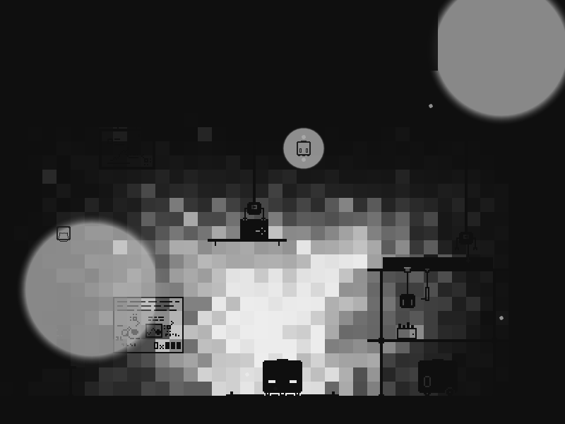
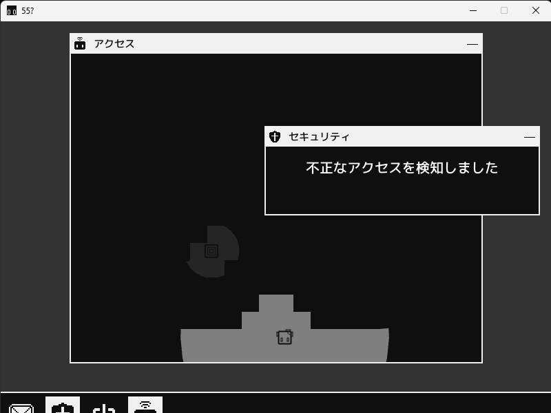
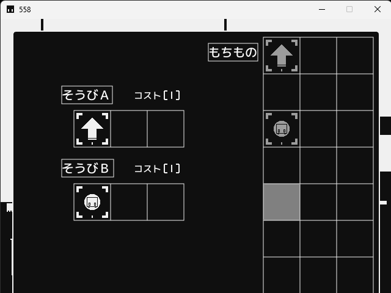
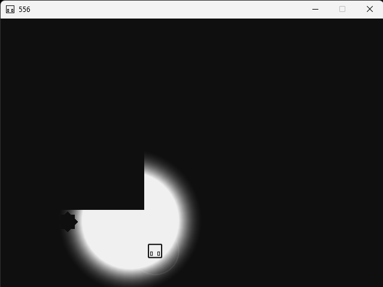

# mori08

## Activity
[Siv3D](https://siv3d.github.io/) を使ってゲーム開発をしています。

  <picture>
    <source media="(prefers-color-scheme: dark)" srcset="https://github-stats-extended.vercel.app/api/top-langs/?username=mori08&layout=compact&theme=github_dark_dimmed" />
    
  </picture>
  <picture>
    <source media="(prefers-color-scheme: dark)" srcset="https://github-stats-extended.vercel.app/api?username=mori08&show_icons=true&theme=github_dark_dimmed" />
    
  </picture>

## Now

<a href="https://github.com/mori08/Ash2">
  <picture>
    <source media="(prefers-color-scheme: dark)" srcset="https://github-stats-extended.vercel.app/api/pin/?username=mori08&repo=Ash2&theme=github_dark_dimmed" />
    
  </picture>
</a> 
<a href="https://github.com/mori08/rust-practice">
  <picture>
    <source media="(prefers-color-scheme: dark)" srcset="https://github-stats-extended.vercel.app/api/pin/?username=mori08&repo=rust-practice&theme=github_dark_dimmed" />
    
  </picture>
</a>

## Works

|  |  |
|---|---|
|  | **一ノ一** モノクロのドット絵の世界で、退化に抗うロボットたちの2Dアドベンチャー リリース: 2026 ・ [Steam](https://store.steampowered.com/app/4022520/) ・ Repo: 非公開 🔒 |
|  | **55?** ロボットと話して、会いに行く リリース: 2024 ・ [ふりーむ!](https://www.freem.ne.jp/win/game/32846) / [Repo](https://github.com/mori08/KokoHatena) |
|  | **558** ステージに合わせた光を装備してゴールを目指す リリース: 2020 ・ [ふりーむ!](https://www.freem.ne.jp/win/game/22184) / [Repo](https://github.com/mori08/Kokoha) |
|  | **556** 自機をキーボード、光をマウスで操作してゴールを目指す リリース: 2019 ・ [ふりーむ!](https://www.freem.ne.jp/win/game/21008) / [Repo](https://github.com/mori08/Robot) |
